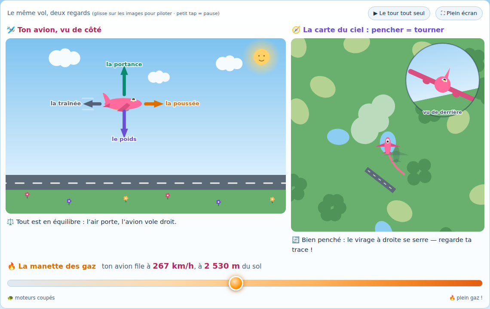

# Comment volent les avions ? 🛩️

Un épisode du **Petit labo de physique** — la série sœur du
[Petit labo d'astronomie](#les-labos) : un site d'une page, interactif, pour expliquer à une
enfant de 5 ans, guidée par un parent qui lit à voix haute, comment un avion vole, décolle,
tourne et atterrit.

La grande révélation : **l'air est costaud**. On ne le voit pas, mais c'est lui qui porte
les avions ! L'aile, en avançant vite, **pousse l'air vers le bas — alors l'air pousse
l'aile vers le haut** (action-réaction). Pas de vitesse, pas de portance : c'est pour ça
qu'un avion posé ne s'envole pas, et qu'il court si vite sur la piste avant de décoller.

Tout le site tient dans une idée : **les 4 forces dessinées comme des flèches vivantes** —
le « graphe » que l'enfant lit sans savoir lire. Quand la flèche de l'air dépasse la flèche
du poids… l'avion décolle !


## Fonctionnalités

- **Deux vues synchronisées en permanence** sur le même vol :
  - **🛩️ Ton avion, vu de côté** (canvas) : la piste, l'herbe, le grand ciel de jour — ton
    avion rose (avec son petit pilote) reste à poste fixe pendant que le décor défile. Les
    **4 flèches** accrochées à l'avion changent de longueur en direct : 💨 la **portance**
    (l'air pousse en haut), 🌍 le **poids** (la Terre tire en bas), 🔥 la **poussée** (les
    moteurs), 🌬️ la **traînée** (l'air freine). Chaque force garde sa couleur partout —
    flèches, légende, boutons, histoires.
  - **🧭 Vu de derrière : pencher = tourner** (canvas) : on penche les ailes, l'horizon
    s'incline, la portance penchée pousse de côté — et la **mini-carte vue de dessus**
    montre la trajectoire qui s'incurve. Plus on penche, plus le virage est serré (avec un
    plafond doux).
- Sous chaque vue, une **petite phrase d'état** raconte le même instant deux fois (« 💨
  L'air pousse plus fort que le poids : ton avion monte ! » / « 🔄 Penché vers la droite :
  l'air pousse de côté, l'avion tourne ! »).
- **Deux commandes, pas une de plus** : la grande **manette des gaz** 🔥 (la piste du
  curseur va des moteurs coupés au plein feu) et le **geste direct sur les vues** — glisser
  vers le haut/bas sur la vue de côté pour monter/descendre, glisser à gauche/droite sur la
  vue de derrière pour pencher (flèches du clavier aussi). Relâche : tout revient au neutre,
  en douceur.
- **Le vol vit tout seul** : un tour d'avion complet en boucle — décollage, montée,
  croisière, virage, descente, atterrissage, freinage… et ça recommence. Petit tap sur une
  vue = pause ; espace = pause ; toute commande manuelle rend la main à l'enfant.


- **Quatre boutons-scénarios** : 🛫 *Le décollage*, ✈️ *La croisière*, 🔄 *Le virage*, 🛬
  *L'atterrissage*. L'avion **glisse en douceur** vers le moment choisi (jamais de marche
  arrière brutale), le joue pour de vrai, puis une micro-histoire raconte le même instant
  **vu de côté puis vu de derrière**. Comme dans la série astronomie, le jeu existe **avec
  ou sans la voix** (bouton 🔇/🔊, choix retenu d'une visite à l'autre).
- **La boîte « 💨 L'air est costaud ! »** : la grande révélation en cinq petits paragraphes
  à lire à voix haute — souffle sur ta main, pousse le mur, l'aile pousse l'air et l'air
  pousse l'aile — qui se referment sur le refrain de l'épisode : *… parce que l'air
  pousse !* À lire… ou à **écouter** : le conteur de la série (synthèse vocale de
  l'appareil, phrase à phrase, pauses et relief) avec choix de voix française — **partagé
  avec les labos d'astronomie** (même clé, même origine github.io).
- **Le pont de fin de page** : « Et une fusée, là où il n'y a plus d'air… qui la pousse ? »
  — et la passerelle vers les 4 épisodes du Petit labo d'astronomie.
- **Plein écran** des deux vues (API native, repli maison pour iOS), mise en page mobile
  dédiée : sous 640 px les vues s'empilent, rien ne recouvre jamais les canvas.
- Accessible : aria-labels descriptifs sur les deux canvas, pilotage au clavier (canvas
  focusables, flèches), espace = pause, `prefers-reduced-motion` respecté (rien ne bouge
  tout seul), focus visibles.



## Lancer en local

Aucune dépendance, aucun build. Il faut juste un petit serveur statique
(les modules ES ne se chargent pas depuis `file://`) :

```bash
python3 -m http.server 8000
# ou : npx serve
```

puis ouvrir <http://localhost:8000>.

## Tests

Le modèle de vol (forces, décollage, croisière, virage, atterrissage, scénarios) est pur —
aucun accès DOM — et se teste sous Node, sans navigateur :

```bash
node test/model.test.mjs
```

**59 vérifications**, dont les vérités du récit : la **portance grandit avec la vitesse**
(∝ v² — nulle à l'arrêt : un avion posé ne s'envole jamais tout seul) ; l'avion **décolle
quand la portance dépasse le poids** (la vitesse de décollage est testée au point près) ;
**en croisière stable, portance = poids et poussée = traînée** ; la **traînée freine
toujours** et, moteurs coupés, l'avion **plane** (descente plafonnée — il ne tombe jamais
comme une pierre) ; **pencher les ailes = tourner**, plus on penche plus le virage est
serré, avec un plafond doux ; près du sol, l'**arrondi est automatique** et le toucher
**toujours doux** ; et surtout **jamais punitif** : 40 vols aux commandes aléatoires
(graine fixe), plus de 140 atterrissages observés, zéro crash — depuis n'importe quel
état, gaz coupés, l'avion finit posé, roues arrêtées.

Le site est aussi vérifié en navigateur (Playwright/Chromium, desktop + mobile 390 px) :
zéro erreur console, sondes de pixels (ciel, herbe, piste, la flèche de portance qui
grandit avec la vitesse), glissers sur les deux vues, tap-pause, scénarios, manette des
gaz, plein écran natif **et** repli iOS, `prefers-reduced-motion`, captures examinées aux
moments clés (posé, décollage, croisière, virage, atterrissage).

## Déployer sur GitHub Pages

Le workflow `.github/workflows/deploy-pages.yml` publie le site à chaque push sur `main`.
Dans les réglages du repo : **Settings → Pages → Source : « GitHub Actions »**
(le workflow tente aussi de l'activer automatiquement au premier run).

## Le modèle

Tout est dans [`js/model.js`](js/model.js) (aucun accès DOM, toutes les constantes) :

- **Les forces**, en « poids d'avion » (la flèche du poids sert d'étalon) : portance
  = (v/V_TAKEOFF)² × facteur d'angle d'attaque ; traînée ∝ v² (poussée = traînée pile à
  V_MAX plein gaz) ; poussée = manette × poussée maxi.
- **En vol, l'avion se règle tout seul** pour porter exactement son poids (stabilité
  longitudinale simplifiée) ; le manche ajoute ou retire de l'angle — avec un **plafond
  doux** : pas de décrochage dans le modèle.
- **Le virage** : la vitesse de virage suit la tangente de l'inclinaison (plafonnée à
  40°) ; la portance penchée tient un peu moins en l'air — vrai aussi en vrai.
- **L'arrondi automatique** : la vitesse de descente est plafonnée près du sol
  (`descentCap`), le toucher est toujours doux — c'est le « jamais punitif » de la série.
- **Le tour automatique** : une liste de phases (`AUTO_PHASES`) avec leurs commandes
  cibles et leurs conditions de fin, jouée en boucle — et rejouée par morceaux par les
  scénarios.

## Ce que le site simplifie

- **L'explication du site est la vraie** (l'air dévié vers le bas + action-réaction, la
  portance en v²), mais elle n'est pas complète : les physiciens ajoutent la circulation
  et les champs de pression autour du profil (Bernoulli) — même phénomène, autres outils.
  Le **mythe du « chemin plus long au-dessus de l'aile »** (temps de transit égal), lui,
  est faux, et n'apparaît nulle part — il est signalé comme mythe dans la note aux parents.
- **« Monter = l'air pousse plus fort que le poids »** : vrai au décollage et dès que la
  trajectoire s'incurve vers le haut — mais en montée stabilisée, la portance revient
  porter à peu près le poids, et c'est le **surplus de poussée** qui fait grimper l'avion.
  Le modèle fait monter l'avion à l'excès de portance parce que c'est la course des deux
  flèches que l'enfant lit ; la note aux parents rétablit la vérité.
- **Gaz coupés, l'avion « plane »** en ralentissant doucement ; un vrai planeur, lui,
  pique un peu du nez pour **garder sa vitesse** (c'est elle qui le fait voler) et suit
  une pente régulière. La descente du site est plafonnée, jamais la vitesse entretenue.
- **Le virage ne dépend que de l'inclinaison** dans le modèle ; en vrai, à inclinaison
  égale, un avion **lent** tourne plus serré qu'un avion rapide (le taux de virage vaut
  g·tan(inclinaison)/vitesse). Une variable de moins, la vérité « plus on penche, plus ça
  tourne » reste juste.
- **Pas de décrochage** : tirer trop fort ne donne simplement rien de plus (angle d'attaque
  plafonné en douceur). Le vrai décrochage est nommé dans la note aux parents.
- **Atterrissage toujours doux** : la descente est plafonnée près du sol (l'arrondi est
  automatique) ; rien ne peut s'écraser — l'enfant explore sans peur, c'est voulu.
- **Le virage est coordonné tout seul** (pas de palonnier, pas de dérapage) et les ailes
  reviennent à plat quand on relâche — un vrai avion garde son inclinaison.
- **Vitesses et altitudes arrondies à hauteur d'enfant** : décollage vers 220 km/h,
  croisière 260 km/h à 2 400 m — un avion de ligne décolle vers 250–300 km/h et croise
  vers 900 km/h à 11 000 m. Les proportions des flèches sont gardées lisibles plutôt qu'à
  l'échelle.
- **En vol, manche relâché, l'avion porte pile son poids** (auto-réglage instantané) ; les
  vrais avions font à peu près pareil… en oscillant un peu.
- **La piste est infinie** (toujours là pour se poser, où qu'on soit) et le monde défile
  en boucle : il y a toujours une piste sous l'avion — jamais punitif, là aussi.
- **La voix de lecture** est celle de l'appareil (rien ne part sur Internet) : sa qualité
  varie beaucoup. Le site note les voix françaises disponibles et prend la plus naturelle ;
  le choix est partagé avec les labos d'astronomie (même origine GitHub Pages).

## Structure

```
index.html            page unique (deux vues synchronisées, manette des gaz, scénarios,
                      révélation, pont vers l'astronomie, note aux parents)
css/style.css         palette « Grand ciel de jour », ossature de la série, responsive
                      (bascule mobile ≤ 640 px), aucune lib
js/model.js           modèle de vol pur (forces, intégration, tour automatique,
                      scénarios, couleurs sémantiques) — testable sous Node
js/canvas.js          helpers canvas partagés (fitCanvas, flèches, étiquettes à halo)
js/side.js            vue de côté (piste, ciel, avion + pilote, 4 flèches vivantes)
js/back.js            vue de derrière (horizon incliné, portance penchée, mini-carte)
js/main.js            boucle d'animation + interactions (manette, glissers, tap-pause,
                      scénarios et leur version sonore, plein écran, conteur)
test/model.test.mjs   tests Node du modèle (59 vérifications)
```

## Les labos

**Le petit labo de physique** :

1. 🛩️ **Comment volent les avions ?** (ce site) — l'air est costaud : l'aile pousse l'air
   vers le bas, l'air porte l'avion.

**Le petit labo d'astronomie**, la série sœur :

1. 🌒 [La mécanique des éclipses](https://davidb-prog.github.io/eclipse-explorer/) — les
   deux coïncidences qui fabriquent une éclipse.
2. 🌅 [Où va le Soleil la nuit ?](https://davidb-prog.github.io/ou-va-le-soleil/) — le
   Soleil ne bouge pas : c'est la Terre qui tourne.
3. 🌍 [Quelle heure est-il là-bas ?](https://davidb-prog.github.io/la-terre-tourne/) — la
   Terre tourne, et il n'est pas la même heure partout.
4. 🌙 [Pourquoi la Lune change de forme ?](https://davidb-prog.github.io/la-lune-change-de-forme/)
   — la Lune est toujours à moitié éclairée : on en voit un côté différent chaque nuit.
