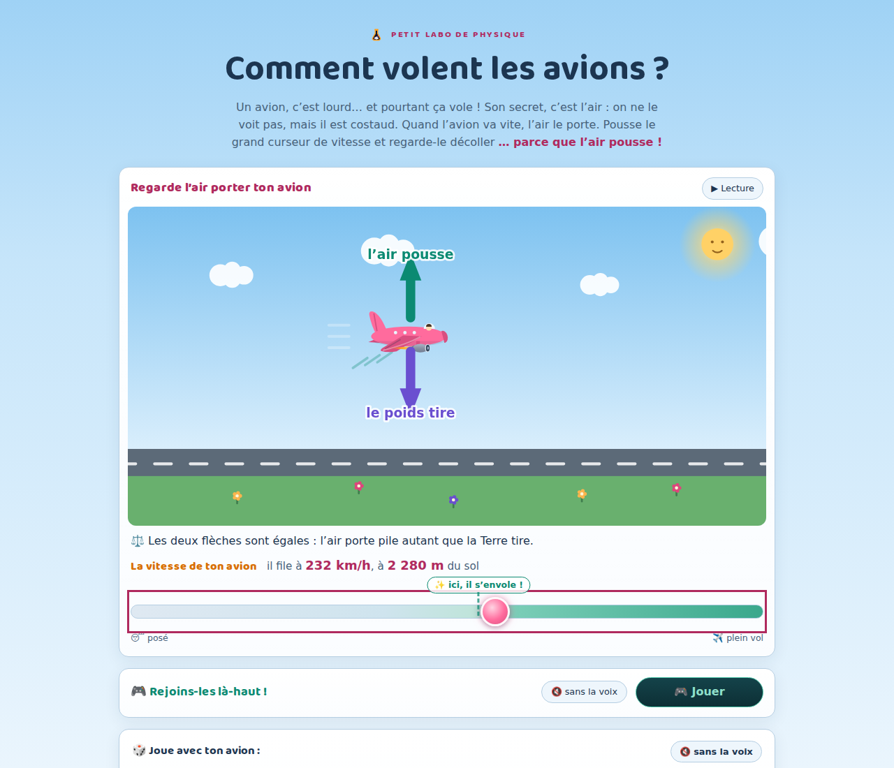
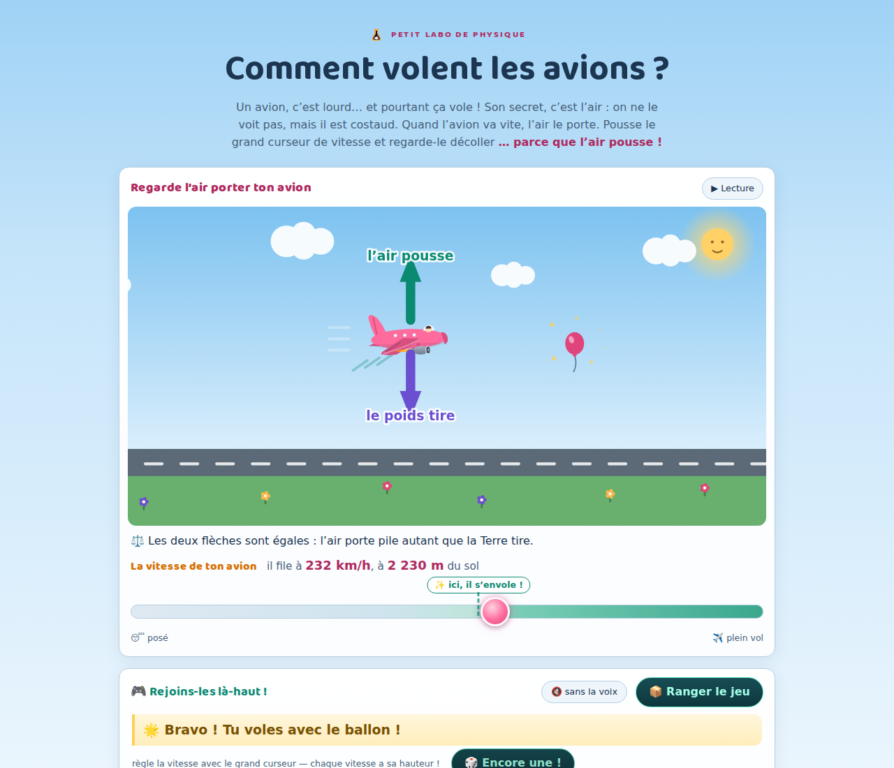
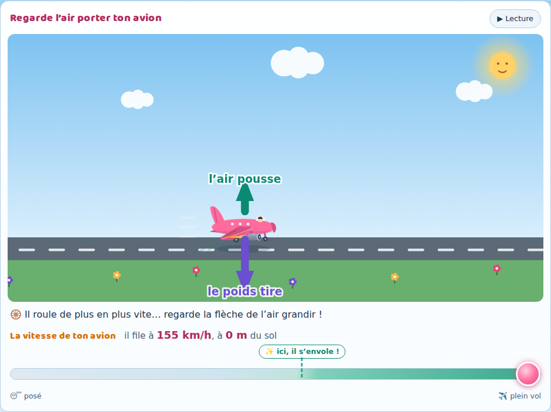
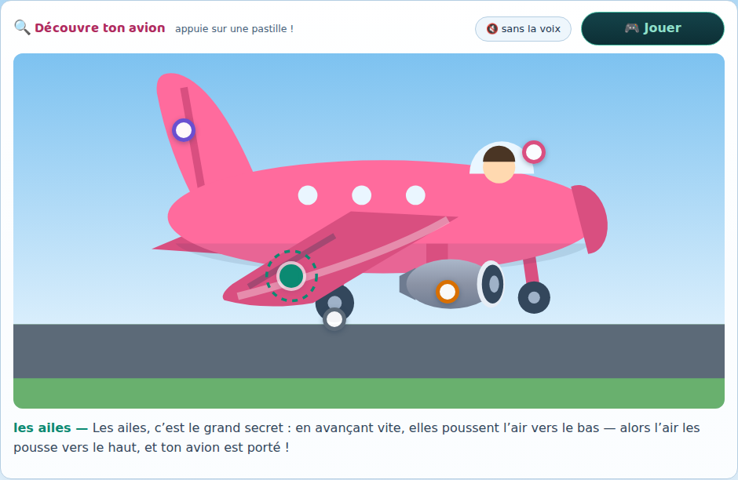

# Comment volent les avions ? 🛩️

Premier épisode du **Petit labo de physique** — la série sœur du
[Petit labo d'astronomie](#la-série) : un site d'une page, interactif, pour expliquer à une
enfant de 5 ans, guidée par un parent qui lit à voix haute, pourquoi les avions volent.

La grande révélation : **l'air est costaud**. On ne le voit pas, mais c'est lui qui porte
les avions ! L'aile, en avançant vite, pousse l'air vers le bas — alors l'air pousse
l'aile vers le haut (action-réaction). **Pas de vitesse, pas d'envol** : c'est pour ça
qu'un avion posé ne s'envole pas, et qu'il roule si vite sur la piste avant de décoller.

Tout l'épisode tient dans UN geste : **le grand curseur de vitesse**. L'enfant pousse la
vitesse, et tout découle — la flèche de l'air grandit, dépasse le poids, l'avion décolle ;
on recule, il plane et se pose tout doux. La course des **deux flèches** (l'air qui
pousse, le poids qui tire) est le « graphe » que l'enfant lit sans savoir lire.



## Fonctionnalités

- **UNE vue, UN geste** (refonte de 2026-08-19, après essai en famille : deux vues et
  leurs gestes croisés perdaient l'enfant) :
  - **la vue de côté** (canvas) : la piste, l'herbe, le grand ciel de jour — ton avion
    rose (avec son petit pilote) reste à poste fixe pendant que le décor défile. Deux
    flèches accrochées à l'avion : 🟢 **l'air pousse** (elle grandit avec la vitesse — ∝ v²,
    nulle à l'arrêt) et 🟣 **le poids tire** (elle ne change jamais). Quand l'avion va
    vite, des filets d'air déviés vers le bas s'échappent derrière l'aile — la cause de
    la portance, dessinée.
  - **le grand curseur de vitesse**, pleine largeur, avec le repère **« ✨ ici, il
    s'envole ! »** posé pile sur la vitesse de décollage du modèle. Sous la vue, une
    petite **phrase d'état** raconte chaque instant (« Il roule… regarde la flèche de
    l'air grandir ! »).
- **La lecture automatique** (bouton ⏸/▶ aux libellés empilés, patron de la famille) :
  un tour complet — décollage, plein vol, atterrissage — en ~85 s, en boucle, le curseur
  bougeant tout seul. Toucher le curseur rend la main à l'enfant. Un tap sur la vue ne
  déclenche **rien** (règle de la famille : pas d'action en douce).
- **Deux boutons-moments** : 🛫 *Le décollage* et 🛬 *L'atterrissage* — les deux vrais
  **événements** du vol, dont la phrase raconte exactement ce qui se passe à l'écran, à
  lire et à écouter (bouton 🔇/🔊 de la famille, choix retenu). Un bouton qui n'a pas de
  sens se grise : on ne décolle pas en vol, on n'atterrit pas déjà posé. (L'ancien
  bouton « ✈️ En plein vol » affichait une phrase d'équilibre pendant que l'écran
  montrait un décollage : l'équilibre est un *état*, pas un événement — il vit dans le
  repère ✨ du curseur et dans le jeu.)
- **La phrase d'état est assise sur la même grandeur que les flèches** (l'excès de
  portance ressentie), avec une graduation honnête — « un tout petit peu plus fort :
  il monte doucement » près du repère : le texte, les flèches et le mouvement ne
  peuvent pas se contredire.
- **« 🎮 Rejoins-les là-haut ! »** — LE jeu de l'épisode, juste sous la scène (la
  consigne, l'avion, l'invité et le curseur restent visibles ensemble) : un invité
  attend à SON altitude — 🎈 le ballon échappé, la montgolfière, l'aigle — et l'enfant
  règle la vitesse pour voler à sa hauteur. C'est la découverte de l'épisode dans les
  doigts : **chaque vitesse a son altitude**. Patron des défis de la famille : fenêtre
  de victoire + tenue, hystérésis de sortie, le bravo ne ment jamais, « 🎲 Encore
  une ! ». Et le défi final renverse la révélation : pour voler aussi bas que le
  papillon… il faut se poser — « en dessous de la vitesse magique, un avion ne vole
  pas : il roule ! ».





- **« 💡 Pourquoi les avions volent ? »** : la grande révélation en cinq petits
  paragraphes à lire à voix haute — souffle sur ta main, pousse le mur, l'aile pousse
  l'air et l'air pousse l'aile — refermés sur le refrain : *… parce que l'air pousse !*
  À lire… ou à **écouter** (conteur de la famille : synthèse vocale de l'appareil, phrase
  à phrase, pauses et relief — rien ne part sur Internet).
- **« 🔍 Découvre ton avion »** : l'avion en grand, dessiné pour que chaque pièce se
  reconnaisse — aile en flèche avec bord d'attaque brillant et ligne de volet, réacteur
  suspendu (lèvre d'entrée d'air, cône de soufflante, tuyère), bulle du cockpit, dérive
  à gouvernail, deux trains, hublots — et cinq **points colorés** à taper (pas d'emoji :
  ils cachaient les pièces et jouaient aux devinettes — le dessin est le seul indice).
  Taper un point affiche l'histoire de la pièce, et la lit si la voix 🔊 est allumée.
  Et son **mode jeu « Où est… ? »** : le site demande une pièce, l'enfant la trouve —
  la bonne gagne un bravo et son histoire en récompense, une autre frétille et dit son
  nom par écrit (jamais punitif, on apprend quand même).
- **Le pont de fin de page** : « Et une fusée, là où il n'y a plus d'air… qui la
  pousse ? » — et la passerelle vers les épisodes d'astronomie, chacun avec le médaillon
  SVG de sa carte du portail.
- **La marque de la famille** : titres en Baloo 2 auto-hébergée, fiole de la série
  physique (le nuage au trait d'avion) à côté du kicker, pied de page harmonisé avec la
  fiole maître vers <https://petit-labo.fr/>, carte de partage `docs/og.png` et socle SEO
  complet (canonique petit-labo.fr, JSON-LD `LearningResource`).



- Accessible : aria-labels descriptifs sur les canvas, curseur au clavier, espace =
  pause, `prefers-reduced-motion` respecté (rien ne bouge tout seul), focus visibles,
  page verrouillée contre les pincements-zooms d'enfant (les zooms d'accessibilité du
  système restent utilisables).

## Lancer en local

Aucune dépendance, aucun build. Il faut juste un petit serveur statique
(les modules ES ne se chargent pas depuis `file://`) :

```bash
python3 -m http.server 8000
# ou : npx serve
```

puis ouvrir <http://localhost:8000>.

## Tests

Le modèle de vol est pur — aucun accès DOM — et se teste sous Node, sans navigateur :

```bash
node test/model.test.mjs
```

**56 vérifications**, dont les vérités du récit : la **portance grandit avec la vitesse**
(∝ v² — nulle à l'arrêt : un avion posé ne s'envole jamais tout seul) ; l'avion
**s'envole quand elle atteint le poids** (la vitesse de décollage est testée au point
près, et le repère du curseur est posé dessus) ; **curseur réduit, il plane** (descente
plafonnée — il ne tombe jamais comme une pierre) ; le **toucher est toujours doux**
(l'arrondi est automatique) ; **jamais punitif** : 40 vols au curseur fou (graine fixe),
zéro crash ; la **lecture automatique** boucle proprement (décolle, monte, se pose,
s'arrête) ; et les textes tiennent leurs promesses (l'avion **roule**, il ne « court »
jamais ; pas de mythe ; apostrophes typographiques).

Le site est aussi vérifié en navigateur (Playwright/Chromium — desktop,
`prefers-reduced-motion`, mobile tactile 390 px) : structure, geste-signature, invariants
d'interaction, sondes de pixels, zéro erreur console.

## Déployer sur GitHub Pages

Le workflow `.github/workflows/deploy-pages.yml` publie le site à chaque push sur `main`.
Dans les réglages du repo : **Settings → Pages → Source : « GitHub Actions »**.
À la publication, côté portail (`davidb-prog.github.io`) : ajouter l'épisode à
`sitemap.xml`, sa carte au portail, et l'entrée `comment-volent-les-avions` au registre
de `tools/build-og.mjs` (la carte `docs/og.png` d'ici a été générée avec la fiole
« physique » ajoutée au gabarit `tools/og.html` — patch à reporter dans le portail).

## Le modèle

Tout est dans [`js/model.js`](js/model.js) (aucun accès DOM, toutes les constantes) :

- **La portance** en « poids d'avion » : `(v / VITESSE_DECOLLAGE)²` — égale au poids
  pile à la vitesse de décollage, qui est aussi le repère du curseur.
- **Le curseur est la seule commande** : la vitesse glisse vers sa consigne (jamais sous
  le plancher de plané en vol), l'excès ou le manque de portance ressentie
  (`portanceEnVol` = portance × densité de l'air) fait monter ou descendre, avec
  l'arrondi automatique près du sol — et l'air raréfié qui arrête la montée là-haut.
- **La lecture automatique** est une fonction pure `cibleAuto(t)` : la position du
  curseur à chaque instant d'un tour de 85 s.
- **Les moments** sont de petites étapes de curseur (`MOMENTS`), jouées en douceur et
  toujours vers l'avant.

## Ce que le site simplifie

- **Deux flèches seulement.** En vrai, quatre forces s'équilibrent en vol : l'air qui
  porte, le poids, la poussée des moteurs, la traînée de l'air qui freine. La course
  air/poids raconte l'essentiel à 5 ans ; l'équilibre complet viendra dans un autre
  épisode. Les flèches sont des vecteurs à l'échelle (le poids sert d'étalon) jusqu'à
  environ deux poids, puis plafonnées pour rester lisibles ; près du haut du ciel, les
  DEUX flèches rétrécissent du même facteur (leur rapport reste exact) pour tenir dans
  l'image ; la pointe garde une taille quasi fixe, comme sur tout schéma de forces.
- **L'air se raréfie avec l'altitude** (`densiteAir`) : là-haut il porte moins, et
  chaque vitesse trouve l'altitude où l'air aminci porte pile le poids — le vrai
  plafond des avions, en version dessin. Conséquence honnête : en palier, les deux
  flèches sont égales à toute altitude, et « plus vite = plus haut ».
- **Une vitesse = une altitude.** C'est le comportement d'un avion dont le coefficient
  de portance ne change jamais (assiette figée — le curseur est la seule commande de
  l'épisode) : L = ½ρv²SC_L = P n'a alors qu'une densité solution par vitesse. En
  vrai, le pilote ajuste l'incidence et peut tenir la même vitesse à plusieurs
  altitudes ; ce qui reste vrai, c'est le plafond — l'altitude maximale grandit avec
  la vitesse. Le jeu s'appuie sur cette règle simple, la note aux parents la déclare.
- **L'explication du site est la vraie** (l'air dévié vers le bas + action-réaction, la
  portance en v²), mais pas complète : les physiciens ajoutent la circulation et les
  champs de pression autour du profil (Bernoulli) — même phénomène, autres outils. Le
  **mythe du « chemin plus long au-dessus de l'aile »** (temps de transit égal), lui, est
  faux et n'apparaît nulle part — il est signalé comme mythe dans la note aux parents.
- **« Monter = l'air pousse plus fort que le poids »** : en toute rigueur (1ʳᵉ loi de
  Newton), une force en trop crée une accélération, pas une vitesse — elle incurve la
  trajectoire, puis la portance revient d'elle-même à l'équilibre et l'avion continue
  de monter à forces équilibrées (L ≈ P·cos γ, la poussée inclinée portant le
  complément vertical), payé par le surplus de *puissance* des moteurs. Le site garde
  la flèche verte plus grande pendant toute la montée : c'est son image du taux de
  montée — flèches inégales ⇔ ça monte ou ça descend, dans le modèle du site.
- **Le curseur règle la vitesse directement** — un vrai pilote pousse une manette de gaz
  et la vitesse suit avec de l'inertie.
- **Jamais de crash** : descente plafonnée partout (il plane), arrondi automatique près
  du sol, pas de décrochage. L'enfant explore sans peur, c'est voulu.
- **Un avion ne s'arrête pas en l'air** : en vol, la vitesse ne descend pas sous un
  plancher de plané (`VITESSE_PLANE`) — curseur à zéro, il garde de l'élan et plane
  jusqu'à la piste, comme un vrai planeur ; on ne freine qu'une fois posé.
- **Vitesses et altitudes à hauteur d'enfant** : décollage vers 220 km/h, plafond du
  dessin 4 000 m — un vrai avion de ligne décolle vers 250–300 km/h et croise vers
  900 km/h à 11 000 m.
- **La piste est infinie** (toujours là pour se poser) et le monde défile en boucle —
  et l'avion peut s'y arrêter tout à fait : c'est le repos du jouet, l'état d'où tout
  repart. En vrai, un avion libère la piste après l'atterrissage et roule jusqu'au
  parking — les bretelles et l'aéroport attendront un autre épisode.
- **Le virage n'est pas dans cet épisode** : pencher les ailes pour tourner est une
  deuxième idée à part entière — elle aura son propre épisode.

## Structure

```
index.html            page unique (vue de côté, grand curseur, moments, révélation,
                      pièces de l'avion, pont vers l'astronomie, note aux parents)
css/style.css         palette « Grand ciel de jour », Baloo 2 auto-hébergée,
                      ossature de la famille, bascule mobile ≤ 640 px
js/model.js           modèle pur (portance, intégration, lecture auto, moments,
                      pièces, couleurs sémantiques) — testable sous Node
js/canvas.js          helpers canvas partagés (fitCanvas, flèches, étiquettes à halo)
js/vue-cote.js        LA vue (piste, ciel, avion + pilote, les deux flèches,
                      filets d'air déviés) — dessineAvionCote partagé
js/vue-pieces.js      « Découvre ton avion » : l'avion en grand, ancres des pastilles
js/main.js            boucle rAF, curseur maître, lecture auto, moments, pièces,
                      conteur vocal de la famille (clé petit-labo-son)
test/model.test.mjs   tests Node du modèle (56 vérifications)
assets/fonts/         Baloo 2 auto-hébergée (woff2, licence OFL — copiée du portail)
docs/                 captures + carte de partage og.png
```

## La série

**Le Petit labo de physique** ✈️ :

1. 🛩️ **Comment volent les avions ?** (ce site) — l'air est costaud : quand l'avion va
   vite, l'air le porte.

**Le Petit labo d'astronomie** 🔭, la série sœur :
[Où va le Soleil la nuit ?](https://petit-labo.fr/ou-va-le-soleil/) ·
[Quelle heure est-il là-bas ?](https://petit-labo.fr/la-terre-tourne/) ·
[Pourquoi la Lune change de forme ?](https://petit-labo.fr/la-lune-change-de-forme/) ·
[La mécanique des éclipses](https://petit-labo.fr/eclipse-explorer/)

Tous les épisodes : <https://petit-labo.fr/>
